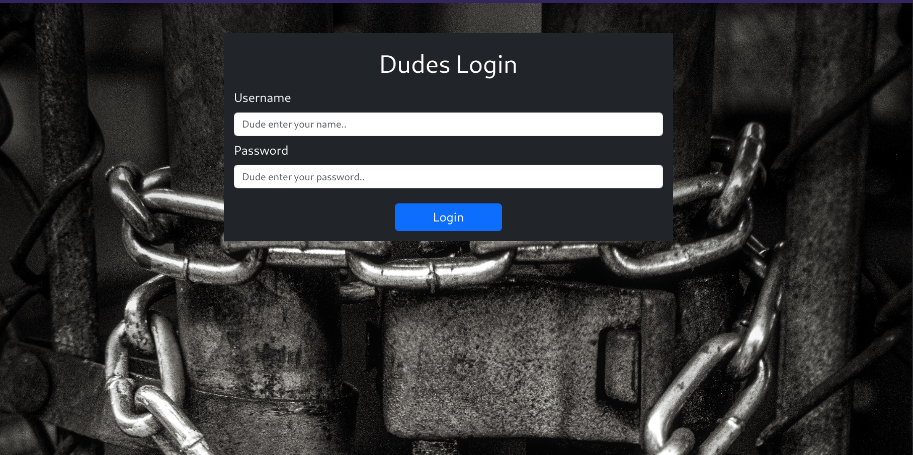
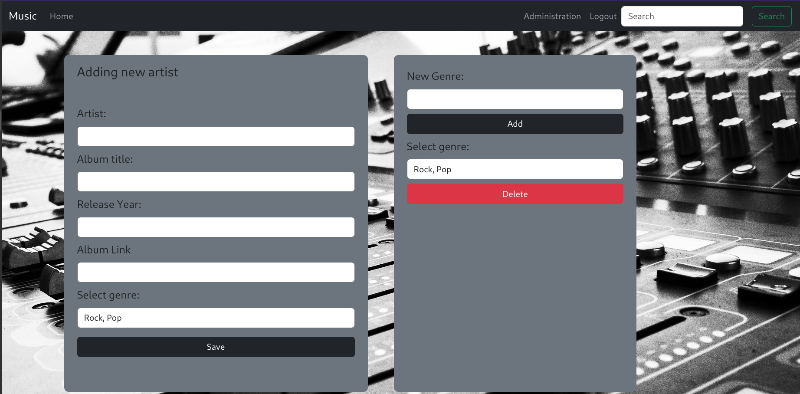
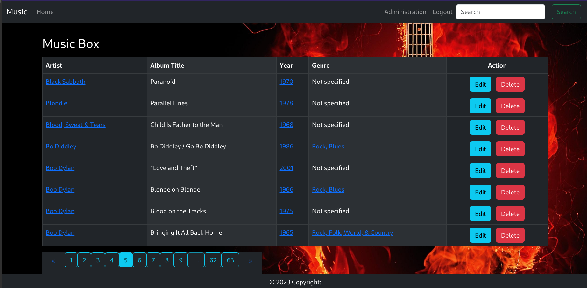
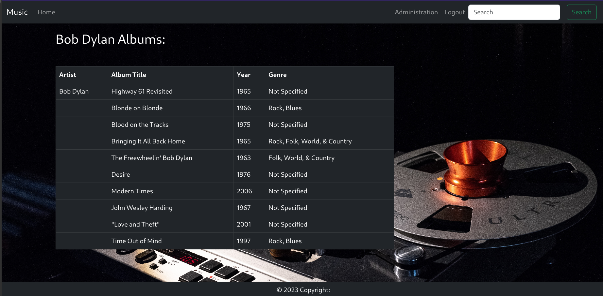
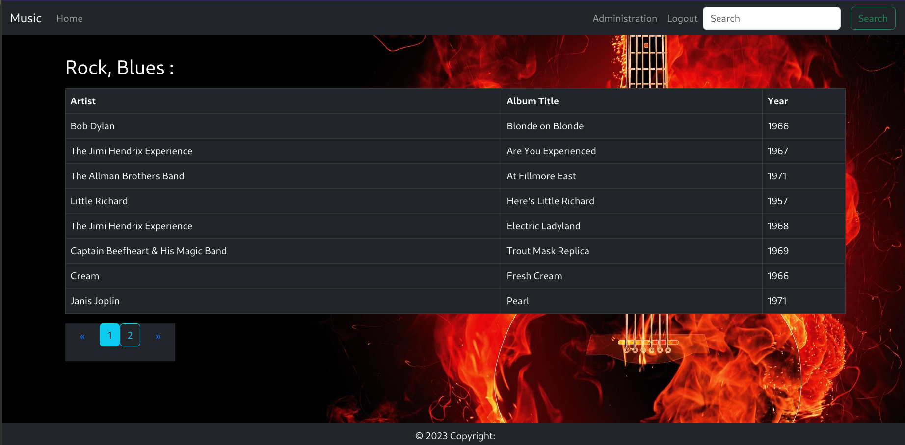
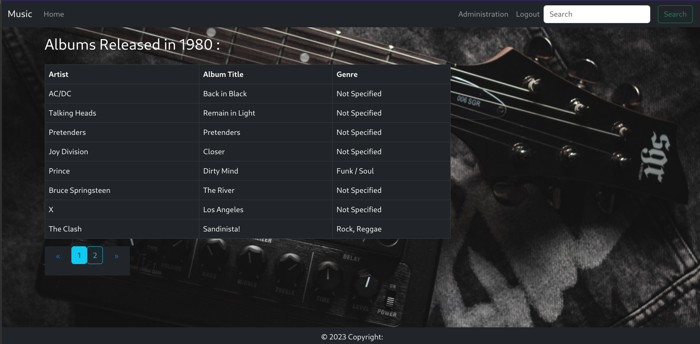

# Simple Flask application for storing music
### Artist,album,genre, released year and link to album
#### Project Structure
````
src
├── src/forms - web forms
├── src/models - db models
├── src/services - for interacting with db
├── src/static
│   ├── src/static/css
│   └── src/static/img
├── src/templates
│   └── src/templates/includes
└── src/views - application routes
tests - application tests
````

Install project requirements
````
pip install -r requirements.txt
````
Create .env file in the root of the project, with following variables
````
SQLALCHEMY_DATABASE_URI - prod db
TEST_DATABASE_URI - tests db can be -> sqlite:///test.db
SECRET_KEY - super secret string
ROWS_PER_PAGE - amount of rows per page
````
To start application run following command:
````
python app.py
````
Alternative way to start application on Linux OS using CLI
````
export FLASK_APP=app.py
flask run
````
On Windows CMD:
````
set FLASK_APP=app.py
flask run
````
To login as admin enter url
````
http://localhost:5000/main/dude/login
````
Admin should be inserted into db directly after creation db and inserted roles into roles table

Login Page:


Admin page:


Home page:


You can navigate to artist, genre, year page by clicking, also if album has link to video it can be open in a new tab

Artist page:


Genre page:


Released by year page:
